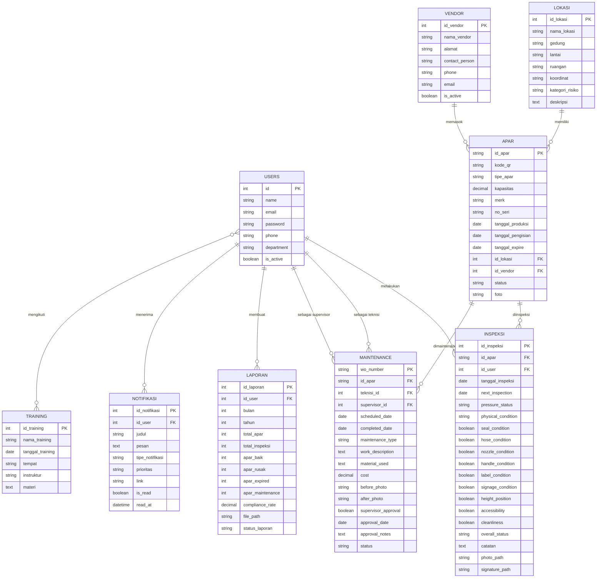

# 📋 Product Requirements Document (PRD)

# SMART-K3 — Sistem Manajemen APAR & Keselamatan Kerja

**Versi Dokumen:** 1.0  
**Tanggal:** 17 Februari 2026  
**Penulis:** Tim Pengembang SMART-K3  
**Status:** Draft

---

## 1. Ringkasan Eksekutif

**SMART-K3** adalah sistem manajemen keselamatan dan kesehatan kerja (K3) berbasis web yang berfokus pada pengelolaan **APAR (Alat Pemadam Api Ringan)**. Sistem ini mencakup seluruh siklus hidup APAR mulai dari pendataan, inspeksi berkala, pemeliharaan (maintenance), pelaporan bulanan, hingga manajemen training K3.

Aplikasi dibangun menggunakan **Laravel 12**, **Livewire 4**, dan **Tailwind CSS** dengan arsitektur full-stack monolith yang mendukung real-time UI interaction tanpa perlu membangun API terpisah.

---

## 2. Latar Belakang & Permasalahan

### Permasalahan

- Pencatatan inspeksi APAR masih dilakukan secara manual (kertas/spreadsheet)
- Tidak ada sistem tracking terpusat untuk status dan lokasi APAR
- Keterlambatan dalam identifikasi APAR expired atau rusak
- Kurangnya visibilitas terhadap compliance rate inspeksi bulanan
- Proses maintenance tidak terstruktur dan sulit dipantau
- Pelaporan bulanan memakan waktu dan rawan kesalahan
- Tidak ada mekanisme notifikasi otomatis untuk pengingat jadwal

### Solusi

Membangun sistem digital terpadu yang mengotomatisasi seluruh proses pengelolaan APAR dan keselamatan kerja dengan fitur real-time dashboard, notifikasi otomatis, dan pelaporan terstruktur.

---

## 3. Tujuan Produk

| #   | Tujuan                       | Key Result                                             |
| --- | ---------------------------- | ------------------------------------------------------ |
| 1   | Digitalisasi pencatatan APAR | 100% data APAR tercatat digital dengan QR code         |
| 2   | Otomatisasi inspeksi         | Inspeksi bulanan terjadwal dengan checklist standar    |
| 3   | Tracking maintenance         | Work order terstruktur dengan approval workflow        |
| 4   | Peningkatan compliance       | Dashboard real-time untuk monitoring kepatuhan         |
| 5   | Pelaporan otomatis           | Laporan bulanan auto-generated dengan export PDF/Excel |
| 6   | Peningkatan kompetensi       | Tracking training K3 dan sertifikasi petugas           |

---

## 4. Target Pengguna & Peran (Roles)

Sistem menggunakan **Spatie Laravel Permission** untuk manajemen role & permission.

| Role           | Deskripsi                      | Akses Utama                                     |
| -------------- | ------------------------------ | ----------------------------------------------- |
| **Admin**      | Administrator sistem           | Semua modul, manajemen user, konfigurasi sistem |
| **Supervisor** | Pengawas/atasan                | Dashboard, approval maintenance, laporan        |
| **Teknisi**    | Petugas inspeksi & maintenance | Inspeksi, maintenance, input data APAR          |
| **Viewer**     | Pengguna baca-saja             | Dashboard, lihat data (tanpa edit)              |

### Atribut User

- Nama, Email, Password, Telepon
- Department
- Status aktif/nonaktif
- Multi-role support

---

## 5. Arsitektur Teknis

### 5.1 Technology Stack

| Layer                | Teknologi                 | Versi |
| -------------------- | ------------------------- | ----- |
| **Backend**          | Laravel                   | 12.x  |
| **Frontend**         | Livewire + Alpine.js      | 4.x   |
| **Styling**          | Tailwind CSS              | 3.x   |
| **Database**         | MySQL / SQLite            | -     |
| **PDF Export**       | DomPDF                    | 3.1   |
| **Excel Export**     | Maatwebsite Excel         | 1.1   |
| **QR Code**          | SimpleSoftwareIO QR Code  | 4.2   |
| **Image Processing** | Intervention Image        | 1.5   |
| **Audit Trail**      | Laravel Auditing          | 14.0  |
| **Auth Token**       | Laravel Sanctum           | 4.3   |
| **Permission**       | Spatie Laravel Permission | 6.24  |
| **Build Tool**       | Vite                      | -     |

### 5.2 Arsitektur Aplikasi

```
┌─────────────────────────────────────────────┐
│                  Browser                     │
│          (Tailwind CSS + Alpine.js)          │
├─────────────────────────────────────────────┤
│              Livewire Components             │
│  ┌─────────┐ ┌────────┐ ┌─────────────────┐ │
│  │Dashboard│ │  APAR  │ │   Inspeksi      │ │
│  ├─────────┤ ├────────┤ ├─────────────────┤ │
│  │Maintain.│ │Laporan │ │   Lokasi        │ │
│  ├─────────┤ ├────────┤ ├─────────────────┤ │
│  │ Vendor  │ │Training│ │  User/Notif     │ │
│  └─────────┘ └────────┘ └─────────────────┘ │
├─────────────────────────────────────────────┤
│        Laravel 12 (Eloquent ORM)             │
├─────────────────────────────────────────────┤
│            MySQL / SQLite Database           │
└─────────────────────────────────────────────┘
```

---

## 6. Modul & Fitur Detail

### 6.1 🏠 Dashboard

**Komponen:** `App\Livewire\Dashboard`

Menampilkan ringkasan informasi keseluruhan sistem secara real-time.

**Fitur:**

- **Statistik Utama:**
    - Total APAR terdaftar
    - APAR aktif, rusak, expired, dalam maintenance
    - Jumlah inspeksi bulan berjalan
    - Maintenance pending/in-progress
    - Compliance rate (%) = inspeksi / total APAR
- **Data Terbaru:**
    - 5 inspeksi terakhir (dengan info APAR, lokasi, user)
    - 5 maintenance terjadwal berikutnya
    - 5 APAR yang akan expired dalam 30 hari
- **Chart/Grafik:**
    - Distribusi status APAR (Aktif/Rusak/Expired/Maintenance)
    - Distribusi tipe APAR (Powder/CO2/Foam/Liquid)

---

### 6.2 🧯 Manajemen APAR

**Komponen:** `AparIndex`, `AparForm`, `AparShow`  
**Model:** `App\Models\Apar`  
**Routes:** `/apar`, `/apar/create`, `/apar/{id}/edit`, `/apar/{id}`

**Fitur:**

- **CRUD APAR:**
    - ID otomatis: `APAR-{YYYY}-{NNNN}`
    - QR Code otomatis (MD5 hash)
    - Upload foto APAR
- **Data APAR:**

    | Field             | Tipe        | Keterangan                                             |
    | ----------------- | ----------- | ------------------------------------------------------ |
    | id_apar           | string (PK) | Auto-generated `APAR-2026-0001`                        |
    | kode_qr           | string      | QR code unik                                           |
    | tipe_apar         | enum        | `powder`, `co2`, `foam`, `liquid`                      |
    | kapasitas         | decimal     | Dalam kg/liter                                         |
    | merk              | string      | Merek APAR                                             |
    | no_seri           | string      | Nomor seri pabrik                                      |
    | tanggal_produksi  | date        | Tanggal produksi                                       |
    | tanggal_pengisian | date        | Tanggal pengisian terakhir                             |
    | tanggal_expire    | date        | Tanggal kadaluarsa                                     |
    | id_lokasi         | FK → lokasi | Lokasi penempatan                                      |
    | id_vendor         | FK → vendor | Vendor pemasok                                         |
    | status            | enum        | `aktif`, `rusak`, `expired`, `maintenance`, `disposed` |
    | foto              | string      | Path foto APAR                                         |

- **Fitur Tambahan:**
    - QR Code generator & download (format PNG)
    - Deteksi otomatis APAR expired
    - Hitung hari menuju expire
    - Filter: tipe, lokasi, status
    - Identifikasi APAR yang belum diinspeksi bulan ini

---

### 6.3 🔍 Inspeksi

**Komponen:** `InspeksiIndex`, `InspeksiForm`  
**Model:** `App\Models\Inspeksi`  
**Routes:** `/inspeksi`, `/inspeksi/create`, `/inspeksi/create/{apar}`, `/inspeksi/{id}`

**Fitur:**

- **Form Inspeksi dengan Checklist Standar:**

    | Item Pemeriksaan                      | Tipe Input                           |
    | ------------------------------------- | ------------------------------------ |
    | Kondisi fisik tabung (penyok, korosi) | Select: `baik` / `cukup` / `rusak`   |
    | Pressure gauge (zona hijau)           | Select: `hijau` / `kuning` / `merah` |
    | Seal/pin pengaman utuh                | Checkbox (boolean)                   |
    | Selang tidak tersumbat, lentur        | Checkbox (boolean)                   |
    | Nozzle bersih, tidak rusak            | Checkbox (boolean)                   |
    | Handle operasi berfungsi              | Checkbox (boolean)                   |
    | Label instruksi jelas terbaca         | Checkbox (boolean)                   |
    | Signage "APAR" terpasang benar        | Checkbox (boolean)                   |
    | Jarak dari lantai 1-1.5 meter         | Checkbox (boolean)                   |
    | Akses tidak terhalang (min. 1 meter)  | Checkbox (boolean)                   |
    | Kebersihan alat dan sekitarnya        | Checkbox (boolean)                   |

- **Penilaian:**
    - Checklist Score (0-11 poin)
    - Overall Status otomatis:
        - ≥ 10 poin → **Baik** 🟢
        - ≥ 7 poin → **Kurang** 🟡
        - < 7 poin → **Rusak** 🔴
- **Data Tambahan:**
    - Catatan/keterangan
    - Upload foto inspeksi
    - Upload tanda tangan digital
    - Jadwal inspeksi berikutnya
- **Query:**
    - Filter inspeksi bulan ini
    - Filter berdasarkan status

---

### 6.4 🔧 Maintenance (Work Order)

**Komponen:** `MaintenanceIndex`  
**Model:** `App\Models\Maintenance`  
**Route:** `/maintenance`

**Fitur:**

- **Work Order Management:**
    - WO Number otomatis: `WO-{YYYYMM}-{NNNN}`
    - Assign teknisi & supervisor
    - Jadwal dan tracking tanggal
- **Data Work Order:**

    | Field            | Tipe        | Keterangan                                                 |
    | ---------------- | ----------- | ---------------------------------------------------------- |
    | wo_number        | string (PK) | Auto-generated                                             |
    | id_apar          | FK → apar   | APAR yang dimaintenance                                    |
    | teknisi_id       | FK → users  | Teknisi pelaksana                                          |
    | supervisor_id    | FK → users  | Supervisor penanggung jawab                                |
    | scheduled_date   | date        | Tanggal dijadwalkan                                        |
    | completed_date   | date        | Tanggal selesai                                            |
    | maintenance_type | enum        | `ringan` (monthly), `sedang` (6-monthly), `berat` (yearly) |
    | work_description | text        | Deskripsi pekerjaan                                        |
    | material_used    | text        | Material yang digunakan                                    |
    | cost             | decimal     | Biaya maintenance                                          |
    | before_photo     | string      | Foto sebelum                                               |
    | after_photo      | string      | Foto sesudah                                               |
    | status           | enum        | `pending`, `in_progress`, `completed`, `cancelled`         |

- **Approval Workflow:**
    - Supervisor approval (boolean)
    - Tanggal approval
    - Catatan approval
- **Status Lifecycle:**
    ```
    pending → in_progress → completed → supervisor approval
                          → cancelled
    ```

---

### 6.5 📊 Laporan (Reporting)

**Komponen:** `LaporanIndex`  
**Model:** `App\Models\Laporan`  
**Route:** `/laporan`

**Fitur:**

- **Laporan Bulanan Otomatis:**
    - Total APAR
    - Total inspeksi bulan tersebut
    - Breakdown: APAR baik / rusak / expired / maintenance
    - Compliance Rate (%)
- **Export:**
    - PDF (via DomPDF)
    - Excel (via Maatwebsite Excel)
    - Filter berdasarkan bulan/tahun
- **Status Laporan:** `draft` / `published`

---

### 6.6 🔔 Notifikasi

**Model:** `App\Models\Notifikasi`

**Fitur:**

- **Tipe Notifikasi:**

    | Tipe          | Icon               | Keterangan                |
    | ------------- | ------------------ | ------------------------- |
    | `inspeksi`    | clipboard-check    | Pengingat inspeksi        |
    | `maintenance` | wrench             | Update maintenance        |
    | `expired`     | exclamation-circle | APAR expired/akan expired |
    | `system`      | cog                | Notifikasi sistem         |

- **Prioritas:** `high` 🔴, `medium` 🟡, `low` 🔵
- **Fitur:**
    - Notifikasi per user & broadcast ke semua user
    - Mark as read/unread
    - Badge counter notifikasi belum dibaca
    - Link langsung ke halaman terkait

---

### 6.7 📍 Manajemen Lokasi

**Komponen:** `LokasiIndex`  
**Model:** `App\Models\Lokasi`  
**Route:** `/lokasi`

**Fitur:**

- **Data Lokasi:**

    | Field           | Tipe   | Keterangan                   |
    | --------------- | ------ | ---------------------------- |
    | nama_lokasi     | string | Nama lokasi                  |
    | gedung          | string | Nama gedung                  |
    | lantai          | string | Lantai                       |
    | ruangan         | string | Nama ruangan                 |
    | koordinat       | string | Koordinat GPS                |
    | kategori_risiko | enum   | `rendah`, `sedang`, `tinggi` |
    | deskripsi       | text   | Keterangan tambahan          |

- Format tampilan: `{Gedung} - Lt. {Lantai} - {Ruangan}`
- Filter berdasarkan gedung dan kategori risiko
- Relasi ke daftar APAR di lokasi tersebut

---

### 6.8 🏢 Manajemen Vendor

**Komponen:** `VendorIndex`  
**Model:** `App\Models\Vendor`  
**Route:** `/vendor`

**Fitur:**

- **Data Vendor:**
    - Nama vendor, alamat
    - Contact person, telepon, email
    - Status aktif/nonaktif
- Relasi ke daftar APAR yang dipasok

---

### 6.9 🎓 Training K3

**Model:** `App\Models\Training`

**Fitur:**

- **Data Training:**
    - Nama training, tanggal, tempat, instruktur
    - Materi pelatihan
- **Tracking Peserta (Pivot: `training_user`):**
    - Kehadiran (boolean)
    - Nilai/skor
    - Path sertifikat
    - Catatan
- **Query:**
    - Filter training upcoming vs past
    - Hitung jumlah peserta & kehadiran

---

### 6.10 👤 Manajemen User

**Komponen:** `UserIndex`  
**Route:** `/users` (Admin only, middleware: `can:user.view`)

**Fitur:**

- CRUD user dengan role assignment
- Aktivasi/deaktivasi akun
- Filter berdasarkan department
- Profil user dengan halaman dedicated (`/profile`)

---

## 7. Database Schema (ERD)



---

## 8. Autentikasi & Otorisasi

### 8.1 Autentikasi

- **Login:** Email + Password (via `AuthController`)
- **Session-based** authentication (Laravel default)
- **API Token:** Laravel Sanctum (untuk integrasi masa depan)
- **Logout:** POST `/logout`
- **Middleware:** `auth` untuk semua route terproteksi, `guest` untuk halaman login

### 8.2 Otorisasi (Permission-based)

Menggunakan **Spatie Laravel Permission** dengan tabel:

- `roles` — Daftar role
- `permissions` — Daftar permission
- `model_has_roles` — Relasi user-role
- `model_has_permissions` — Relasi user-permission langsung
- `role_has_permissions` — Relasi role-permission

**Permission yang diimplementasi:**

- `user.view` — Akses halaman manajemen user

---

## 9. Non-Functional Requirements

### 9.1 Performa

- Halaman dashboard load < 2 detik
- Livewire response time < 500ms
- Pagination untuk semua list view

### 9.2 Keamanan

- Password hashing (bcrypt)
- CSRF protection (Laravel default)
- Role-based access control
- Audit trail (Laravel Auditing — prepared, belum aktif)

### 9.3 Responsivitas

- Responsive design (Tailwind CSS)
- Sidebar hamburger menu untuk mobile
- Loading animation overlay untuk Livewire requests
- Toast notification system (success/error/warning)

### 9.4 UX/UI

- Real-time update tanpa page reload (Livewire)
- Global loading indicator dengan progress bar
- Badge system untuk status visual
- Color-coded status indicators

---

## 10. Integrasi & Export

| Fitur              | Library                  | Format                        |
| ------------------ | ------------------------ | ----------------------------- |
| QR Code APAR       | SimpleSoftwareIO QR Code | SVG (display), PNG (download) |
| Export Laporan PDF | Barryvdh DomPDF          | PDF                           |
| Export Data Excel  | Maatwebsite Excel        | XLSX                          |
| Image Processing   | Intervention Image       | JPG/PNG                       |

---

## 11. Roadmap & Status Pengembangan

### ✅ Sudah Diimplementasi

- [x] Autentikasi (Login/Logout)
- [x] Dashboard dengan statistik & chart
- [x] CRUD APAR dengan QR Code
- [x] Form Inspeksi dengan checklist standar
- [x] Maintenance / Work Order management
- [x] Laporan bulanan otomatis
- [x] Notifikasi system
- [x] Manajemen Lokasi, Vendor, User
- [x] Training management
- [x] Role & Permission (Spatie)
- [x] Export PDF & Excel
- [x] Loading animation & toast notifications
- [x] Responsive sidebar (burger layout)

### 🔲 Rencana Pengembangan

- [ ] Aktivasi Audit Trail (Laravel Auditing)
- [ ] Notifikasi push / email
- [ ] Scheduling inspeksi otomatis (Laravel scheduler)
- [ ] REST API untuk integrasi mobile app
- [ ] Denah lokasi interaktif (map view)
- [ ] Barcode scanner via kamera mobile
- [ ] Dashboard analytics lanjutan (trend, prediksi)
- [ ] Multi-tenant support (multi-perusahaan)

---

## 12. Glosarium

| Istilah             | Definisi                                             |
| ------------------- | ---------------------------------------------------- |
| **K3**              | Keselamatan dan Kesehatan Kerja                      |
| **APAR**            | Alat Pemadam Api Ringan (portable fire extinguisher) |
| **WO**              | Work Order (perintah kerja maintenance)              |
| **QR Code**         | Quick Response Code untuk identifikasi APAR          |
| **Compliance Rate** | Tingkat kepatuhan inspeksi (%)                       |
| **Pressure Gauge**  | Pengukur tekanan tabung APAR                         |
| **Signage**         | Tanda/papan penunjuk lokasi APAR                     |

---

> **Dokumen ini bersifat living document** dan akan diperbarui seiring perkembangan fitur dan kebutuhan stakeholder.
