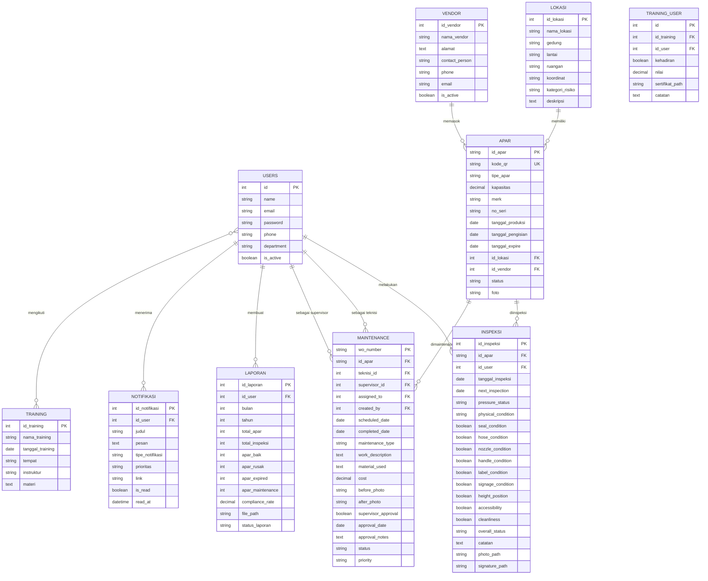

# 📋 Product Requirements Document (PRD)

# SMART-K3 — Sistem Manajemen APAR & Keselamatan Kerja

**Versi Dokumen:** 2.0  
**Tanggal:** 18 Februari 2026  
**Penulis:** Tim Pengembang SMART-K3  
**Status:** Living Document — Diperbarui berdasarkan progres pengembangan

---

## Daftar Isi

1. [Ringkasan Eksekutif](#1-ringkasan-eksekutif)
2. [Latar Belakang & Permasalahan](#2-latar-belakang--permasalahan)
3. [Tujuan Produk](#3-tujuan-produk)
4. [Target Pengguna & Peran](#4-target-pengguna--peran-roles)
5. [Arsitektur Teknis](#5-arsitektur-teknis)
6. [Modul & Fitur Detail](#6-modul--fitur-detail)
7. [Database Schema (ERD)](#7-database-schema-erd)
8. [Autentikasi & Otorisasi](#8-autentikasi--otorisasi)
9. [User Interface & UX](#9-user-interface--ux)
10. [Non-Functional Requirements](#10-non-functional-requirements)
11. [Integrasi & Export](#11-integrasi--export)
12. [Status Pengembangan & Changelog](#12-status-pengembangan--changelog)
13. [Roadmap](#13-roadmap)
14. [Glosarium](#14-glosarium)

---

## 1. Ringkasan Eksekutif

**SMART-K3** adalah sistem manajemen keselamatan dan kesehatan kerja (K3) berbasis web yang berfokus pada pengelolaan **APAR (Alat Pemadam Api Ringan)**. Sistem ini mencakup seluruh siklus hidup APAR mulai dari pendataan, inspeksi berkala, pemeliharaan (maintenance), pelaporan bulanan, hingga manajemen training K3.

Aplikasi dibangun menggunakan **Laravel 12**, **Livewire 4**, dan **Tailwind CSS** dengan arsitektur full-stack monolith yang mendukung real-time UI interaction tanpa perlu membangun API terpisah.

### Scope Produk

| Aspek           | Cakupan                                                                   |
| --------------- | ------------------------------------------------------------------------- |
| **Core Domain** | Manajemen lifecycle APAR (pendataan → inspeksi → maintenance → pelaporan) |
| **Secondary**   | Training K3, Notifikasi, Manajemen User & Role                            |
| **Integration** | QR Code, PDF/Excel Export, Image Processing, Audit Trail                  |
| **Platform**    | Web-based (responsive, mendukung desktop & mobile browser)                |

---

## 2. Latar Belakang & Permasalahan

### 2.1 Permasalahan

| #   | Permasalahan                                                    | Dampak                                         |
| --- | --------------------------------------------------------------- | ---------------------------------------------- |
| 1   | Pencatatan inspeksi APAR masih manual (kertas/spreadsheet)      | Data tidak terpusat, rawan hilang              |
| 2   | Tidak ada sistem tracking terpusat untuk status dan lokasi APAR | Sulit mengetahui kondisi APAR secara real-time |
| 3   | Keterlambatan identifikasi APAR expired atau rusak              | Risiko keselamatan meningkat                   |
| 4   | Kurangnya visibilitas compliance rate inspeksi bulanan          | Tidak ada metrik kepatuhan                     |
| 5   | Proses maintenance tidak terstruktur                            | Sulit dipantau, tidak ada approval workflow    |
| 6   | Pelaporan bulanan memakan waktu dan rawan kesalahan             | Ineffisiensi operasional                       |
| 7   | Tidak ada mekanisme notifikasi otomatis                         | Jadwal inspeksi/maintenance terlewat           |

### 2.2 Solusi

Membangun sistem digital terpadu yang mengotomatisasi seluruh proses pengelolaan APAR dan keselamatan kerja dengan fitur:

- **Dashboard real-time** untuk monitoring keseluruhan
- **Digitalisasi inspeksi** dengan checklist standar
- **Work Order system** dengan approval workflow
- **Notifikasi otomatis** untuk pengingat jadwal
- **Pelaporan terstruktur** dengan export PDF/Excel
- **QR Code** untuk identifikasi cepat APAR

---

## 3. Tujuan Produk

| #   | Tujuan                       | Key Result                                             | Status     |
| --- | ---------------------------- | ------------------------------------------------------ | ---------- |
| 1   | Digitalisasi pencatatan APAR | 100% data APAR tercatat digital dengan QR code         | ✅ Selesai |
| 2   | Otomatisasi inspeksi         | Inspeksi bulanan terjadwal dengan checklist standar    | ✅ Selesai |
| 3   | Tracking maintenance         | Work order terstruktur dengan approval workflow        | ✅ Selesai |
| 4   | Peningkatan compliance       | Dashboard real-time untuk monitoring kepatuhan         | ✅ Selesai |
| 5   | Pelaporan otomatis           | Laporan bulanan auto-generated dengan export PDF/Excel | ✅ Selesai |
| 6   | Peningkatan kompetensi       | Tracking training K3 dan sertifikasi petugas           | ✅ Selesai |

---

## 4. Target Pengguna & Peran (Roles)

Sistem menggunakan **Spatie Laravel Permission** untuk manajemen role & permission.

### 4.1 Definisi Role

| Role           | Deskripsi                      | Akses Utama                                     |
| -------------- | ------------------------------ | ----------------------------------------------- |
| **Admin**      | Administrator sistem           | Semua modul, manajemen user, konfigurasi sistem |
| **Supervisor** | Pengawas/atasan                | Dashboard, approval maintenance, laporan        |
| **Teknisi**    | Petugas inspeksi & maintenance | Inspeksi, maintenance, input data APAR          |
| **Viewer**     | Pengguna baca-saja             | Dashboard, lihat data (tanpa edit)              |

### 4.2 Atribut User

| Field      | Tipe              | Keterangan                            |
| ---------- | ----------------- | ------------------------------------- |
| name       | string            | Nama lengkap                          |
| email      | string            | Email (unique, untuk login)           |
| password   | string            | Password (bcrypt hashed)              |
| phone      | string (nullable) | Nomor telepon                         |
| department | string (nullable) | Departemen                            |
| is_active  | boolean           | Status aktif/nonaktif (default: true) |

### 4.3 Permission Matrix

| Permission      | Admin | Supervisor    | Teknisi | Viewer    |
| --------------- | ----- | ------------- | ------- | --------- |
| `user.view`     | ✅    | ❌            | ❌      | ❌        |
| Dashboard       | ✅    | ✅            | ✅      | ✅        |
| APAR CRUD       | ✅    | ✅ (read)     | ✅      | ✅ (read) |
| Inspeksi        | ✅    | ✅ (read)     | ✅      | ✅ (read) |
| Maintenance     | ✅    | ✅ (approval) | ✅      | ✅ (read) |
| Laporan         | ✅    | ✅            | ❌      | ✅ (read) |
| User Management | ✅    | ❌            | ❌      | ❌        |

---

## 5. Arsitektur Teknis

### 5.1 Technology Stack

#### A. Core Framework & Languages

| Komponen               | Teknologi      | Versi | Deskripsi                                                                  |
| :--------------------- | :------------- | :---- | :------------------------------------------------------------------------- |
| **Backend Framework**  | **Laravel**    | 12.x  | PHP Framework modern, aman, dan scalable.                                  |
| **Language**           | **PHP**        | 8.2+  | Bahasa pemrograman server-side.                                            |
| **Frontend Framework** | **Livewire**   | 4.x   | Full-stack framework untuk antarmuka dinamis tanpa membangun API terpisah. |
| **Scripting**          | **JavaScript** | ES6+  | Alpine.js untuk interaktivitas ringan di sisi klien.                       |
| **Database**           | **MySQL**      | 8.0+  | Relational Database Management System (RDBMS).                             |

#### B. Frontend & UI

| Komponen          | Teknologi                 | Deskripsi                                                                         |
| :---------------- | :------------------------ | :-------------------------------------------------------------------------------- |
| **CSS Framework** | **Tailwind CSS** v3.x     | Utility-first CSS framework untuk styling cepat dan kustomisasi mudah.            |
| **UI Components** | **DaisyUI** + **Mary UI** | Plugin komponen Tailwind untuk UI elemen yang konsisten dan aesthetic.            |
| **Icons**         | **Blade Heroicons**       | Set ikon SVG modern yang terintegrasi langsung dengan blade.                      |
| **Interactivity** | **Alpine.js** v3.x        | Framework JS ringan untuk state management di frontend (modal, dropdown, toggle). |
| **Charting**      | **ApexCharts**            | Library charting interaktif untuk dashboard visualisasi data.                     |
| **Font**          | **Plus Jakarta Sans**     | Font utama aplikasi (Google Fonts).                                               |

#### C. Backend Libraries & Packages

| Package                       | Fungsi                                                                  |
| :---------------------------- | :---------------------------------------------------------------------- |
| **Spatie Laravel Permission** | Manajemen Role & Permission (RBAC) yang robust.                         |
| **Barryvdh DomPDF**           | Generasi laporan dalam format PDF.                                      |
| **Maatwebsite Excel**         | Export dan import data dalam format Excel (.xlsx).                      |
| **SimpleSoftwareIO QR Code**  | Generator QR Code untuk identifikasi aset APAR.                         |
| **Intervention Image**        | Manipulasi dan optimasi gambar upload pengguna.                         |
| **Laravel Auditing**          | Mencatat riwayat aktivitas pengguna (audit trail).                      |
| **Laravel Sanctum**           | Otentikasi API token (siap untuk pengembangan mobile app dimasa depan). |

#### D. Development & Environment

| Alat                | Deskripsi                                                  |
| :------------------ | :--------------------------------------------------------- |
| **Vite**            | Build tool frontend yang sangat cepat untuk aset (CSS/JS). |
| **Composer**        | Dependency manager untuk PHP.                              |
| **NPM**             | Package manager untuk JavaScript.                          |
| **Git**             | Version control system.                                    |
| **Laragon / XAMPP** | Lingkungan server lokal (Apache/Nginx, MySQL, PHP).        |

### 5.2 Arsitektur Aplikasi

```
┌──────────────────────────────────────────────────┐
│                    Browser                        │
│         (Tailwind CSS + Alpine.js + ApexCharts)   │
├──────────────────────────────────────────────────┤
│               Livewire Components                 │
│  ┌──────────┐ ┌─────────┐ ┌────────────────────┐ │
│  │Dashboard │ │  APAR   │ │     Inspeksi       │ │
│  ├──────────┤ ├─────────┤ ├────────────────────┤ │
│  │Maintenan.│ │ Laporan │ │     Lokasi         │ │
│  ├──────────┤ ├─────────┤ ├────────────────────┤ │
│  │  Vendor  │ │Training │ │   User / Notif     │ │
│  └──────────┘ └─────────┘ └────────────────────┘ │
├──────────────────────────────────────────────────┤
│  Middleware:  auth, guest, can:permission          │
├──────────────────────────────────────────────────┤
│         Laravel 12 (Eloquent ORM + Spatie)        │
├──────────────────────────────────────────────────┤
│              MySQL / SQLite Database              │
└──────────────────────────────────────────────────┘
```

### 5.3 Struktur Direktori Utama

```
smart-k3/
├── app/
│   ├── Http/Controllers/       # AuthController
│   ├── Livewire/               # Semua Livewire components
│   │   ├── Dashboard.php
│   │   ├── Apar/               # AparIndex, AparForm, AparShow
│   │   ├── Inspeksi/           # InspeksiIndex, InspeksiForm
│   │   ├── Maintenance/        # MaintenanceIndex
│   │   ├── Laporan/            # LaporanIndex
│   │   ├── Lokasi/             # LokasiIndex
│   │   ├── Vendor/             # VendorIndex
│   │   └── User/               # UserIndex
│   ├── Models/                 # Eloquent models (9 model)
│   ├── Providers/
│   └── View/                   # View composers
├── database/
│   └── migrations/             # 15 migration files
├── resources/
│   └── views/
│       ├── layouts/            # app.blade.php (primary), secondary
│       ├── livewire/           # Blade views per modul
│       ├── auth/               # Login page
│       ├── profile/            # Profile page
│       └── components/         # Reusable components
├── routes/
│   └── web.php                 # All route definitions
└── public/                     # Compiled assets
```

---

## 6. Modul & Fitur Detail

### 6.1 🏠 Dashboard

**Komponen:** `App\Livewire\Dashboard`  
**Route:** `/` (home)

Menampilkan ringkasan informasi keseluruhan sistem secara real-time.

**Fitur yang diimplementasi:**

- **Statistik Utama (Stat Cards):**
    - Total APAR terdaftar
    - APAR aktif, rusak, expired, dalam maintenance
    - Jumlah inspeksi bulan berjalan
    - Maintenance pending/in-progress
    - Compliance rate (%) = inspeksi bulan ini / total APAR × 100
- **Data Terbaru:**
    - 5 inspeksi terakhir (dengan info APAR, lokasi, user)
    - 5 maintenance terjadwal berikutnya (status: pending/in_progress)
    - 5 APAR yang akan expired dalam 30 hari
- **Chart/Grafik (ApexCharts):**
    - Distribusi status APAR (Aktif/Rusak/Expired/Maintenance) — color-coded
    - Distribusi tipe APAR (Powder/CO2/Foam/Liquid)

**Warna Status APAR pada Chart (Pastel Palette):**
| Status | Warna | Hex |
|--------|-------|-----|
| Aktif | 🟢 Emerald Pastel | `#86EFAC` |
| Rusak | 🔴 Rose Pastel | `#FDA4AF` |
| Expired | 🟡 Amber Pastel | `#FDE68A` |
| Maintenance | 🔵 Sky Pastel | `#7DD3FC` |

---

### 6.2 🧯 Manajemen APAR

**Komponen:** `AparIndex`, `AparForm`, `AparShow`  
**Model:** `App\Models\Apar`  
**Routes:** `/apar`, `/apar/create`, `/apar/{id}/edit`, `/apar/{id}`, `/apar/{id}/qr-download`

#### 6.2.1 CRUD APAR

| Aksi       | Deskripsi                                                                                |
| ---------- | ---------------------------------------------------------------------------------------- |
| **Create** | Form input data APAR baru, ID otomatis `APAR-{YYYY}-{NNNN}`, QR Code otomatis (MD5 hash) |
| **Read**   | Tabel index dengan pagination, search, filter, sorting + detail view per APAR            |
| **Update** | Edit semua field APAR, upload/ganti foto                                                 |
| **Delete** | Soft confirmation modal sebelum delete                                                   |

#### 6.2.2 Data APAR (Schema)

| Field             | Tipe                   | Keterangan                                                                |
| ----------------- | ---------------------- | ------------------------------------------------------------------------- |
| id_apar           | string(50) PK          | Auto-generated `APAR-2026-0001`                                           |
| kode_qr           | string(100) UNIQUE     | QR code unik (MD5 hash)                                                   |
| tipe_apar         | enum                   | `powder`, `co2`, `foam`, `liquid`                                         |
| kapasitas         | decimal(5,2)           | Berat dalam kg                                                            |
| merk              | string                 | Merek APAR                                                                |
| no_seri           | string (nullable)      | Nomor seri pabrik                                                         |
| tanggal_produksi  | date                   | Tanggal produksi                                                          |
| tanggal_pengisian | date (nullable)        | Tanggal pengisian terakhir                                                |
| tanggal_expire    | date                   | Tanggal kadaluarsa                                                        |
| id_lokasi         | FK → lokasi            | Lokasi penempatan (required)                                              |
| id_vendor         | FK → vendor (nullable) | Vendor pemasok                                                            |
| status            | enum                   | `aktif`, `rusak`, `expired`, `maintenance`, `disposed` (default: `aktif`) |
| foto              | string (nullable)      | Path foto APAR (uploaded)                                                 |

**Indexes:** `status`, `tanggal_expire`, `tipe_apar`

#### 6.2.3 Fitur Tambahan

- **QR Code:** Generator & download PNG (route: `/apar/{id}/qr-download`) via SimpleSoftwareIO
- **Deteksi expired:** Otomatis hitung APAR yang tanggal_expire < now()
- **Search:** ID APAR, merek, no seri, nama/gedung lokasi
- **Filter:** Status, Tipe APAR, Lokasi
- **Sorting:** Semua field (toggle asc/desc)
- **Query String:** Search & filter tersimpan di URL (`?search=&filterStatus=&filterTipe=`)
- **Stat Cards:** Total APAR, Aktif, Rusak, Expired

---

### 6.3 🔍 Inspeksi

**Komponen:** `InspeksiIndex`, `InspeksiForm`  
**Model:** `App\Models\Inspeksi`  
**Routes:** `/inspeksi`, `/inspeksi/create`, `/inspeksi/create/{apar}`, `/inspeksi/{id}`

#### 6.3.1 Form Inspeksi — Checklist Standar

| #   | Item Pemeriksaan                      | Tipe Input                           | Scoring |
| --- | ------------------------------------- | ------------------------------------ | ------- |
| 1   | Kondisi fisik tabung (penyok, korosi) | Select: `baik` / `cukup` / `rusak`   | N/A     |
| 2   | Pressure gauge (zona hijau)           | Select: `hijau` / `kuning` / `merah` | N/A     |
| 3   | Seal/pin pengaman utuh                | Checkbox (boolean)                   | 1 poin  |
| 4   | Selang tidak tersumbat, lentur        | Checkbox (boolean)                   | 1 poin  |
| 5   | Nozzle bersih, tidak rusak            | Checkbox (boolean)                   | 1 poin  |
| 6   | Handle operasi berfungsi              | Checkbox (boolean)                   | 1 poin  |
| 7   | Label instruksi jelas terbaca         | Checkbox (boolean)                   | 1 poin  |
| 8   | Signage "APAR" terpasang benar        | Checkbox (boolean)                   | 1 poin  |
| 9   | Jarak dari lantai 1-1.5 meter         | Checkbox (boolean)                   | 1 poin  |
| 10  | Akses tidak terhalang (min. 1 meter)  | Checkbox (boolean)                   | 1 poin  |
| 11  | Kebersihan alat dan sekitarnya        | Checkbox (boolean)                   | 1 poin  |

#### 6.3.2 Sistem Penilaian

| Score Range | Overall Status | Indikator |
| ----------- | -------------- | --------- |
| ≥ 10 poin   | **Baik**       | 🟢 Hijau  |
| ≥ 7 poin    | **Kurang**     | 🟡 Kuning |
| < 7 poin    | **Rusak**      | 🔴 Merah  |

#### 6.3.3 Data Tambahan

| Field           | Tipe              | Keterangan                  |
| --------------- | ----------------- | --------------------------- |
| catatan         | text (nullable)   | Keterangan tambahan         |
| photo_path      | string (nullable) | Upload foto bukti inspeksi  |
| signature_path  | string (nullable) | Upload tanda tangan digital |
| next_inspection | date (nullable)   | Jadwal inspeksi berikutnya  |

#### 6.3.4 Fitur

- **Deep link:** Inspeksi langsung dari halaman detail APAR (`/inspeksi/create/{apar}`)
- **Filter:** Inspeksi bulan ini, berdasarkan overall_status
- **Pressure gauge visual:** Indikator visual warna sesuai status

---

### 6.4 🔧 Maintenance (Work Order)

**Komponen:** `MaintenanceIndex`  
**Model:** `App\Models\Maintenance`  
**Route:** `/maintenance`

#### 6.4.1 Work Order Management

- WO Number otomatis: `WO-{YYYYMMDD}-{NNNN}` (per hari)
- Modal form untuk create work order
- Assign teknisi berdasarkan role (query `User::role('teknisi')`)
- Stat cards: pending, in_progress, completed

#### 6.4.2 Data Work Order (Schema)

| Field               | Tipe                  | Keterangan                                                              |
| ------------------- | --------------------- | ----------------------------------------------------------------------- |
| wo_number           | string(50) PK         | Auto-generated `WO-20260217-0001`                                       |
| id_apar             | FK → apar             | APAR yang dimaintenance                                                 |
| teknisi_id          | FK → users (nullable) | Teknisi pelaksana                                                       |
| supervisor_id       | FK → users (nullable) | Supervisor penanggung jawab                                             |
| assigned_to         | FK → users (nullable) | Ditugaskan ke (added later)                                             |
| created_by          | FK → users (nullable) | Dibuat oleh (added later)                                               |
| scheduled_date      | date                  | Tanggal dijadwalkan                                                     |
| completed_date      | date (nullable)       | Tanggal selesai                                                         |
| maintenance_type    | enum                  | `ringan` (bulanan), `sedang` (6 bulan), `berat` (tahunan)               |
| work_description    | text (nullable)       | Deskripsi pekerjaan                                                     |
| material_used       | text (nullable)       | Material yang digunakan                                                 |
| cost                | decimal(12,2)         | Biaya maintenance (default: 0)                                          |
| before_photo        | string (nullable)     | Foto sebelum                                                            |
| after_photo         | string (nullable)     | Foto sesudah                                                            |
| supervisor_approval | boolean               | Approval supervisor (default: false)                                    |
| approval_date       | date (nullable)       | Tanggal approval                                                        |
| approval_notes      | text (nullable)       | Catatan approval                                                        |
| status              | enum                  | `pending`, `in_progress`, `completed`, `cancelled` (default: `pending`) |
| priority            | enum                  | `low`, `normal`, `high`, `urgent` (default: `normal`)                   |

**Indexes:** `status`, `scheduled_date`, `maintenance_type`

#### 6.4.3 Status Lifecycle & Approval

```
pending → in_progress → completed → supervisor approval
                      → cancelled
```

#### 6.4.4 Form Validation Rules

```php
'id_apar'           => 'required|exists:apar,id_apar'
'maintenance_type'  => 'required|in:ringan,sedang,berat'
'description'       => 'required|min:10'
'scheduled_date'    => 'required|date|after_or_equal:today'
'priority'          => 'required|in:low,normal,high,urgent'
```

---

### 6.5 📊 Laporan (Reporting)

**Komponen:** `LaporanIndex`  
**Model:** `App\Models\Laporan`  
**Route:** `/laporan`

#### 6.5.1 Laporan Bulanan Otomatis

| Data             | Keterangan                     |
| ---------------- | ------------------------------ |
| Total APAR       | Jumlah seluruh APAR terdaftar  |
| Total Inspeksi   | Inspeksi pada bulan laporan    |
| APAR Baik        | Count status `aktif`           |
| APAR Rusak       | Count status `rusak`           |
| APAR Expired     | Count status `expired`         |
| APAR Maintenance | Count status `maintenance`     |
| Compliance Rate  | (Inspeksi / Total APAR) × 100% |

#### 6.5.2 Schema Laporan

| Field            | Tipe              | Keterangan                              |
| ---------------- | ----------------- | --------------------------------------- |
| id_laporan       | PK auto-increment | ID laporan                              |
| id_user          | FK → users        | Pembuat laporan                         |
| bulan            | integer           | Bulan laporan (1-12)                    |
| tahun            | integer           | Tahun laporan                           |
| total_apar       | integer           | Snapshot total APAR                     |
| total_inspeksi   | integer           | Snapshot total inspeksi                 |
| apar_baik        | integer           | Count APAR baik                         |
| apar_rusak       | integer           | Count APAR rusak                        |
| apar_expired     | integer           | Count APAR expired                      |
| apar_maintenance | integer           | Count APAR maintenance                  |
| compliance_rate  | decimal(5,2)      | Rate kepatuhan (%)                      |
| file_path        | string (nullable) | Path file laporan                       |
| status_laporan   | enum              | `draft`, `published` (default: `draft`) |

**Constraints:** UNIQUE(`bulan`, `tahun`)

#### 6.5.3 Fitur

- Generate laporan per bulan/tahun (`Laporan::generateMonthlyReport()`)
- Histori 12 laporan terakhir
- Export PDF (DomPDF) dan Excel (Maatwebsite)
- Filter bulan/tahun

---

### 6.6 🔔 Notifikasi

**Model:** `App\Models\Notifikasi`

#### 6.6.1 Tipe Notifikasi

| Tipe          | Icon               | Keterangan                |
| ------------- | ------------------ | ------------------------- |
| `inspeksi`    | clipboard-check    | Pengingat inspeksi        |
| `maintenance` | wrench             | Update maintenance        |
| `expired`     | exclamation-circle | APAR expired/akan expired |
| `system`      | cog                | Notifikasi sistem         |

#### 6.6.2 Prioritas

| Prioritas | Indikator |
| --------- | --------- |
| `high`    | 🔴 Merah  |
| `medium`  | 🟡 Kuning |
| `low`     | 🔵 Biru   |

#### 6.6.3 Fitur

- Notifikasi per user & broadcast ke semua user
- Mark as read/unread
- Badge counter notifikasi belum dibaca
- Link langsung ke halaman terkait
- Timestamp `read_at` saat dibaca

**Indexes:** `(id_user, is_read)`, `tipe_notifikasi`

---

### 6.7 📍 Manajemen Lokasi

**Komponen:** `LokasiIndex`  
**Model:** `App\Models\Lokasi`  
**Route:** `/lokasi`

#### Data Lokasi

| Field           | Tipe              | Keterangan                                       |
| --------------- | ----------------- | ------------------------------------------------ |
| id_lokasi       | PK auto-increment | ID lokasi                                        |
| nama_lokasi     | string            | Nama lokasi                                      |
| gedung          | string            | Nama gedung                                      |
| lantai          | string            | Lantai                                           |
| ruangan         | string            | Nama ruangan                                     |
| koordinat       | string (nullable) | Koordinat GPS                                    |
| kategori_risiko | enum              | `rendah`, `sedang`, `tinggi` (default: `sedang`) |
| deskripsi       | text (nullable)   | Keterangan tambahan                              |

**Index:** `(gedung, lantai)`  
**Format tampilan:** `{Gedung} - Lt. {Lantai} - {Ruangan}`

**Fitur:**

- Filter berdasarkan gedung dan kategori risiko
- Relasi ke daftar APAR di lokasi tersebut

---

### 6.8 🏢 Manajemen Vendor

**Komponen:** `VendorIndex`  
**Model:** `App\Models\Vendor`  
**Route:** `/vendor`

#### Data Vendor

| Field          | Tipe              | Keterangan                            |
| -------------- | ----------------- | ------------------------------------- |
| id_vendor      | PK auto-increment | ID vendor                             |
| nama_vendor    | string            | Nama vendor                           |
| alamat         | text (nullable)   | Alamat                                |
| contact_person | string            | Nama contact person                   |
| phone          | string            | Telepon                               |
| email          | string (nullable) | Email                                 |
| is_active      | boolean           | Status aktif/nonaktif (default: true) |

**Fitur:**

- Relasi ke daftar APAR yang dipasok
- Filter aktif/nonaktif

---

### 6.9 🎓 Training K3

**Model:** `App\Models\Training`

#### Data Training

| Field            | Tipe              | Keterangan          |
| ---------------- | ----------------- | ------------------- |
| id_training      | PK auto-increment | ID training         |
| nama_training    | string            | Nama training       |
| tanggal_training | date              | Tanggal pelaksanaan |
| tempat           | string            | Tempat pelaksanaan  |
| instruktur       | string            | Nama instruktur     |
| materi           | text (nullable)   | Materi pelatihan    |

#### Tracking Peserta (Pivot: `training_user`)

| Field           | Tipe                    | Keterangan                    |
| --------------- | ----------------------- | ----------------------------- |
| id_training     | FK                      | Relasi ke training            |
| id_user         | FK                      | Relasi ke users               |
| kehadiran       | boolean                 | Status hadir (default: false) |
| nilai           | decimal(5,2) (nullable) | Nilai/skor                    |
| sertifikat_path | string (nullable)       | Path file sertifikat          |
| catatan         | text (nullable)         | Catatan                       |

**Constraint:** UNIQUE(`id_training`, `id_user`)

**Fitur:**

- Filter training upcoming vs past
- Hitung jumlah peserta & kehadiran

---

### 6.10 👤 Manajemen User

**Komponen:** `UserIndex`  
**Route:** `/users` (Admin only, middleware: `can:user.view`)

**Fitur:**

- CRUD user dengan role assignment (Spatie)
- Aktivasi/deaktivasi akun
- Filter berdasarkan department
- Profil user dengan halaman dedicated (`/profile`)

---

## 7. Database Schema (ERD)



### Tabel Tambahan (Spatie Permission)

| Tabel                   | Keterangan                                       |
| ----------------------- | ------------------------------------------------ |
| `roles`                 | Daftar role (admin, supervisor, teknisi, viewer) |
| `permissions`           | Daftar permission                                |
| `model_has_roles`       | Relasi user ↔ role                               |
| `model_has_permissions` | Relasi user ↔ permission langsung                |
| `role_has_permissions`  | Relasi role ↔ permission                         |

### Tabel Tambahan (Laravel Auditing)

| Tabel    | Keterangan                                         |
| -------- | -------------------------------------------------- |
| `audits` | Audit trail log (prepared, belum aktif sepenuhnya) |

---

## 8. Autentikasi & Otorisasi

### 8.1 Autentikasi

| Aspek      | Implementasi                                           |
| ---------- | ------------------------------------------------------ |
| Login      | Email + Password via `AuthController`                  |
| Session    | Session-based (Laravel default)                        |
| API Token  | Laravel Sanctum (prepared, untuk integrasi masa depan) |
| Logout     | POST `/logout`                                         |
| Middleware | `auth` (route terproteksi), `guest` (halaman login)    |

### 8.2 Route Protection

```php
// Guest routes
Route::middleware('guest') → /login (GET, POST)

// Authenticated routes
Route::middleware('auth') → semua route lainnya

// Admin-only routes
Route::middleware('can:user.view') → /users
```

### 8.3 Otorisasi (Spatie)

Permission-based access control menggunakan Spatie Laravel Permission:

- Role assignment per user
- Permission check via middleware `can:permission.name`
- Blade directives: `@can`, `@role`

---

## 9. User Interface & UX

### 9.1 Layout

| Komponen             | Deskripsi                                               |
| -------------------- | ------------------------------------------------------- |
| **Primary Layout**   | `layouts/app.blade.php` — sidebar, navbar, content area |
| **Secondary Layout** | Layout alternatif dengan ApexCharts CDN                 |
| **Login Page**       | `auth/login.blade.php` — halaman login terpisah         |
| **Profile Page**     | `profile/index.blade.php`                               |

### 9.2 Sidebar Navigation

- Dashboard
- APAR (Data APAR)
- Inspeksi
- Maintenance
- Laporan
- Lokasi
- Vendor
- Users (Admin only)
- **Responsive hamburger menu** untuk mobile

### 9.3 Komponen UX

| Fitur                     | Implementasi                                                           |
| ------------------------- | ---------------------------------------------------------------------- |
| **Loading Animation**     | Overlay global dengan progress bar untuk Livewire requests (Alpine.js) |
| **Toast Notifications**   | Sistem notifikasi toast (success, error, warning) via Livewire events  |
| **Dark Mode Toggle**      | Toggle dark/light mode                                                 |
| **Badge System**          | Status badges dengan warna per status (Aktif=hijau, Rusak=merah, dll)  |
| **Confirmation Modal**    | Dialog konfirmasi untuk aksi delete                                    |
| **Pagination**            | Semua list view menggunakan Livewire pagination (10 per halaman)       |
| **Real-time Update**      | Livewire reactive UI tanpa page reload                                 |
| **Color-coded Tipe APAR** | Warna berbeda untuk setiap tipe APAR (Powder, CO2, Foam, Liquid)       |

---

## 10. Non-Functional Requirements

### 10.1 Performa

| Metrik                 | Target                              | Strategi                                    |
| :--------------------- | :---------------------------------- | :------------------------------------------ |
| Dashboard load time    | **< 2 detik** (10 concurrent users) | Cache::remember + single aggregated SQL     |
| Livewire response time | **< 500ms**                         | Selective eager loading, column constraints |
| Pagination             | 10 items per halaman                | Semua list view                             |
| Concurrent users       | **10 pengguna simultan**            | Connection pooling, query optimization      |

**Strategi Optimasi Performa:**

1. **Query Aggregasi** — Statistik dashboard menggunakan satu query `SUM(CASE WHEN...)` alih-alih 5 query `COUNT(*)` terpisah.
2. **Cache Layer** — `Cache::remember()` dengan TTL:
    - Statistik: 2 menit (`dashboard:stats`)
    - Data terbaru: 1 menit (`dashboard:recent`)
    - Chart data: 2 menit (`dashboard:tipe`)
3. **Selective Eager Loading** — Relasi di-load dengan kolom spesifik (`apar:id_apar,id_lokasi`).

### 10.2 Keamanan

| Aspek             | Implementasi                                          |
| :---------------- | :---------------------------------------------------- |
| Password          | bcrypt hashing (Laravel default)                      |
| CSRF              | CSRF token protection (Laravel default)               |
| Access Control    | Role-based (Spatie) + middleware                      |
| Audit Trail       | Laravel Auditing (package installed, belum aktif)     |
| Input Validation  | Laravel validation rules di setiap Livewire component |
| **Rate Limiting** | Throttle middleware berbasis IP + User ID             |

**Konfigurasi Rate Limiting (`AppServiceProvider`):**

| Limiter    | Limit             | Key          | Fungsi                               |
| :--------- | :---------------- | :----------- | :----------------------------------- |
| `login`    | **5 req/menit**   | email + IP   | Mencegah brute-force login           |
| `web`      | **60 req/menit**  | User ID / IP | Rate limit halaman umum              |
| `livewire` | **120 req/menit** | User ID      | AJAX request Livewire (lebih tinggi) |
| `export`   | **10 req/menit**  | User ID / IP | Mencegah abuse PDF/Excel export      |

### 10.3 Responsivitas

- Responsive design via Tailwind CSS breakpoints
- Sidebar hamburger menu untuk viewport mobile
- Tabel responsif dengan scroll horizontal

### 10.4 Browser Support

- Chrome (latest)
- Firefox (latest)
- Safari (latest)
- Edge (latest)

---

## 11. Integrasi & Export

| Fitur              | Library                  | Format                        | Status      |
| ------------------ | ------------------------ | ----------------------------- | ----------- |
| QR Code APAR       | SimpleSoftwareIO QR Code | SVG (display), PNG (download) | ✅ Aktif    |
| Export Laporan PDF | Barryvdh DomPDF          | PDF                           | ✅ Aktif    |
| Export Data Excel  | Maatwebsite Excel        | XLSX                          | ✅ Aktif    |
| Image Processing   | Intervention Image       | JPG/PNG                       | ✅ Aktif    |
| Audit Trail        | Laravel Auditing         | Database logs                 | ⏳ Prepared |
| API Token          | Laravel Sanctum          | Bearer token                  | ⏳ Prepared |

---

## 12. Status Pengembangan & Changelog

### 12.1 ✅ Fitur yang Sudah Diimplementasi

#### Core Modules

- [x] **Autentikasi** — Login/Logout session-based via AuthController
- [x] **Dashboard** — Stat cards, chart ApexCharts (status & tipe APAR), recent data, expiring APAR
- [x] **CRUD APAR** — Full CRUD dengan QR Code generator & download, search, filter, sorting, pagination
- [x] **Inspeksi** — Form checklist standar (11 item), penilaian otomatis, foto & tanda tangan, deep link dari APAR
- [x] **Maintenance** — Work order management, WO number otomatis, modal form, priority system, assign teknisi
- [x] **Laporan** — Laporan bulanan auto-generated, compliance rate, histori, export PDF/Excel
- [x] **Notifikasi** — Tipe notifikasi, prioritas, read/unread, badge counter
- [x] **Manajemen Lokasi** — CRUD lokasi dengan gedung/lantai/ruangan, kategori risiko
- [x] **Manajemen Vendor** — CRUD vendor dengan contact info, status aktif/nonaktif
- [x] **Training K3** — Data training, tracking peserta, kehadiran, nilai, sertifikat
- [x] **Manajemen User** — CRUD user dengan role assignment (Spatie), aktivasi/deaktivasi

#### Infrastructure & UX

- [x] **Role & Permission** — Spatie Laravel Permission (admin, supervisor, teknisi, viewer)
- [x] **Export PDF/Excel** — DomPDF + Maatwebsite Excel
- [x] **QR Code** — Generate SVG display + PNG download
- [x] **Loading Animation** — Global overlay + progress bar untuk Livewire requests
- [x] **Toast Notifications** — Success/error/warning via Livewire events + Alpine.js
- [x] **Responsive Sidebar** — Hamburger menu untuk mobile
- [x] **Dark Mode** — Toggle dark/light mode
- [x] **Pressure Gauge Visual** — Indikator visual pada form inspeksi
- [x] **Color-coded Badges** — Status APAR, tipe APAR, prioritas maintenance

### 12.2 📅 Riwayat Pengembangan (Changelog)

| Tanggal           | Perubahan                                                                                                          |
| ----------------- | ------------------------------------------------------------------------------------------------------------------ |
| **Jan 2026**      | Setup awal project, migrasi database, model, seeder                                                                |
| **Awal Feb 2026** | Implementasi form inspeksi, fix checklist & pressure gauge                                                         |
| **3 Feb 2026**    | Fix checkbox behavior inspeksi, improve save button, fix maintenance WO creation, pagination buttons, profile menu |
| **12 Feb 2026**   | Update Livewire ke versi terbaru                                                                                   |
| **17 Feb 2026**   | Tambah loading animation overlay + toast notification system                                                       |
| **17 Feb 2026**   | Fix APAR index (tipe warna, kapasitas Kg), fix form field names                                                    |
| **17 Feb 2026**   | Fix APAR show view field names, update CDN ke ApexCharts                                                           |
| **17 Feb 2026**   | Fix dark mode toggle, chart palette, remove admin section sidebar                                                  |
| **17 Feb 2026**   | Tambah kolom `priority`, `assigned_to`, `created_by` di tabel maintenance                                          |
| **18 Feb 2026**   | Redesign login page (2-column layout, glassmorphism), optimize login speed (remove Livewire overhead)              |
| **18 Feb 2026**   | Ganti warna status APAR ke palette pastel (emerald/rose/amber/sky) di dashboard & apar-index                       |
| **18 Feb 2026**   | Implementasi rate limiting (login 5/min, web 60/min, livewire 120/min, export 10/min)                              |
| **18 Feb 2026**   | Optimasi performa dashboard: query aggregasi, Cache::remember, selective eager loading                             |

---

## 13. Roadmap

### 🔲 Rencana Pengembangan Selanjutnya

| Prioritas | Fitur                        | Deskripsi                                                       |
| --------- | ---------------------------- | --------------------------------------------------------------- |
| 🔴 High   | Aktivasi Audit Trail         | Mengaktifkan Laravel Auditing untuk log semua perubahan data    |
| 🔴 High   | Notifikasi email             | Pengingat inspeksi & maintenance mendekati deadline via email   |
| 🟡 Medium | Scheduling otomatis          | Laravel Scheduler untuk generate inspeksi & notifikasi otomatis |
| 🟡 Medium | REST API                     | API endpoint untuk integrasi aplikasi mobile                    |
| 🟡 Medium | Barcode/QR scanner           | Scan QR Code APAR via kamera mobile browser                     |
| 🟢 Low    | Denah lokasi interaktif      | Map view untuk visualisasi lokasi APAR                          |
| 🟢 Low    | Dashboard analytics lanjutan | Trend analysis, prediksi maintenance, heatmap                   |
| 🟢 Low    | Multi-tenant support         | Dukungan multi-perusahaan dalam satu instalasi                  |
| 🟢 Low    | Mobile app                   | Aplikasi mobile native dengan REST API                          |

---

## 14. Glosarium

| Istilah             | Definisi                                                |
| ------------------- | ------------------------------------------------------- |
| **K3**              | Keselamatan dan Kesehatan Kerja                         |
| **APAR**            | Alat Pemadam Api Ringan (portable fire extinguisher)    |
| **WO**              | Work Order (perintah kerja maintenance)                 |
| **QR Code**         | Quick Response Code untuk identifikasi APAR             |
| **Compliance Rate** | Tingkat kepatuhan inspeksi bulanan (%)                  |
| **Pressure Gauge**  | Pengukur tekanan tabung APAR (zona: hijau/kuning/merah) |
| **Signage**         | Tanda/papan penunjuk lokasi APAR                        |
| **Livewire**        | Laravel full-stack framework untuk reactive UI          |
| **Spatie**          | Package Laravel untuk manajemen role & permission       |
| **DomPDF**          | Library PHP untuk generate file PDF                     |

---

> **Dokumen ini bersifat living document** dan akan diperbarui seiring perkembangan fitur dan kebutuhan stakeholder.  
> **Terakhir diperbarui:** 18 Februari 2026
